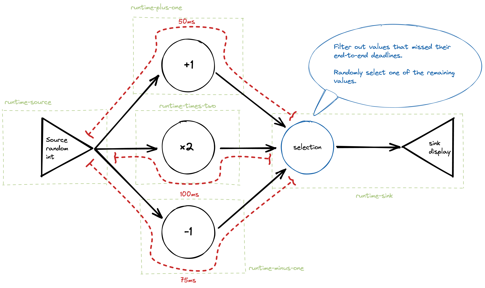

# Zenoh Flow: Deadlines demonstration



## 0. Install the Zenoh Flow runtime example

```sh
cd /tmp
git clone https://github.com/atolab/zenoh-flow-examples.git
cd /tmp/zenoh-flow-examples
cargo build --release -p runtime
```

## 1. Build the different nodes

```sh
cd /tmp
git clone https://github.com/atolab/zenoh-play.git
cd /tmp/zenoh-play/daemon/zenoh-flow-deadlines
cargo build --release
```

## 2. Launch the runtime-sink

Open a new terminal.

```sh
cd /tmp/zenoh-flow-examples/
RUST_LOG=zenoh_flow=warn ./target/release/runtime -g ../zenoh-play/daemon/zenoh-flow-deadlines/graph/daemon-demo.yaml -r runtime-sink
```

The `RUST_LOG=zenoh_flow=warn` enables logging messages for Zenoh Flow and for messages with a severity superior or equal to "Warning". The deadline miss fall into that category and they are the messages we are interested in.

## 2. Launch the operators runtimes

For each runtime you need to open a new terminal. The order in which the runtimes are started is not important.

```sh
cd /tmp/zenoh-flow-examples/
./target/release/runtime -g ../zenoh-play/daemon/zenoh-flow-deadlines/graph/daemon-demo.yaml -r runtime-accumulator
```

```sh
cd /tmp/zenoh-flow-examples/
./target/release/runtime -g ../zenoh-play/daemon/zenoh-flow-deadlines/graph/daemon-demo.yaml -r runtime-plus-one
```

```sh
cd /tmp/zenoh-flow-examples/
./target/release/runtime -g ../zenoh-play/daemon/zenoh-flow-deadlines/graph/daemon-demo.yaml -r runtime-times-two
```

```sh
cd /tmp/zenoh-flow-examples/
./target/release/runtime -g ../zenoh-play/daemon/zenoh-flow-deadlines/graph/daemon-demo.yaml -r runtime-minus-one
```

## 3. Launch the runtime-source

Open a new terminal.

```sh
cd /tmp/zenoh-flow-examples/
./target/release/runtime -g ../zenoh-play/daemon/zenoh-flow-deadlines/graph/daemon-demo.yaml -r runtime-source
```

You should see integers being generated every 5 seconds by the source and transmitted to the different Operators.

Each Operator sleep for a random amount of time to emulate a heavy computational load.

If this sleeping period is greater than the declared deadline then the message will be flagged and ignored at the `Operator-selection`.
